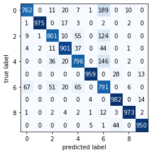

# FashionMnist
This model is an image classifier which classifies images of clothing using Convolutional Neural Network

This model is trained with Mnist dataset and uses Keras for building the Neural Network

# Required Libraries

    1. keras
    2. numpy
    3. matplotlib
    4. sklearn 
    5. os 
    6. pytz
    7. wandb (optional)
    
# Usage 
Play around with the hidden layer parameters in the create_model funciton, add more convulutions etc, see if you can squeeze out more accuracy 
```
  model.add(MaxPooling2D(pool_size=(2, 2)))
  model.add(Dropout(rate=0.4))
  model.add(Conv2D(32,
                  (4, 4),
            input_shape=(img_width, img_height, 1),
            activation='relu'))
  model.add(MaxPooling2D(pool_size=(2, 2)))
  model.add(Dropout(rate=0.4))
  model.add(Flatten(input_shape=(img_width,img_height)))
  model.add(Dense(2 * num_classes, activation='relu'))
  model.add(Dense(num_classes, activation='softmax'))
```

See what the model got right and what it got wrong.




Checkout training data of this model at https://app.wandb.ai/nauqgnesh/fashion-mnist

All code related to weights and biases have been commented out. If you would like to create your own project, add your wandb login and uncommented related code
